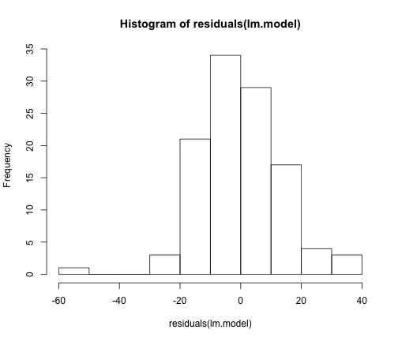
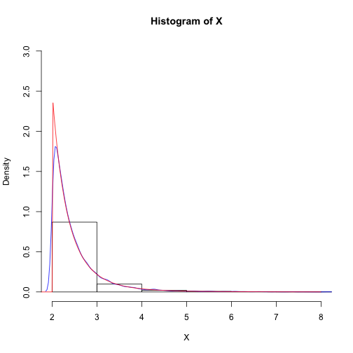

Tarea 4 - Estadística Computacional
========================================================

Itzel Muñoz - Alfonso Kim
--------------------------------------------------------


```r
set.seed(145849)
```


## Ejercicio 1


```r
azul <- c(4, 69, 87, 35, 39, 79, 31, 79, 65, 95, 68, 62, 70, 80, 84, 79, 66, 
    75, 59, 77, 36, 86, 39, 85, 74, 72, 69, 85, 85, 72)
rojo <- c(62, 80, 82, 83, 0, 81, 28, 69, 48, 90, 63, 77, 0, 55, 83, 85, 54, 
    72, 58, 68, 88, 83, 78, 30, 58, 45, 78, 64, 87, 65)
datos <- data.frame(id = c(rep(0, 20), rep(1, 10)), azul = azul, rojo = rojo)

datos
```

```
##    id azul rojo
## 1   0    4   62
## 2   0   69   80
## 3   0   87   82
## 4   0   35   83
## 5   0   39    0
## 6   0   79   81
## 7   0   31   28
## 8   0   79   69
## 9   0   65   48
## 10  0   95   90
## 11  0   68   63
## 12  0   62   77
## 13  0   70    0
## 14  0   80   55
## 15  0   84   83
## 16  0   79   85
## 17  0   66   54
## 18  0   75   72
## 19  0   59   58
## 20  0   77   68
## 21  1   36   88
## 22  1   86   83
## 23  1   39   78
## 24  1   85   30
## 25  1   74   58
## 26  1   72   45
## 27  1   69   78
## 28  1   85   64
## 29  1   85   87
## 30  1   72   65
```

```r

attach(datos)
```

```
## The following object is masked _by_ .GlobalEnv:
## 
##     azul, rojo
```


a.1) Pruebas de hipótesis en diferencia de medias

```r
n <- 20
dbarra <- mean(azul[1:20]) - mean(rojo[1:20])

d <- array(0, 20)
for (i in 1:20) {
    d[i] <- azul[i] - rojo[i]
}

suma <- 0
for (i in 1:20) {
    suma <- suma + (d[i] - dbarra)^2
}

Sd <- sqrt(suma/(n - 1))

gamma <- 0.05
t_alfa <- pt(1 - (gamma/2), n - 1)

c1 <- -t_alfa
c2 <- t_alfa

tobs <- dbarra/(Sd * sqrt(1/n))
```

#### Por lo tanto, tobs no pertenece a la región de rechazo 

a.2) Intervalo de Confianza 

```r
linf <- dbarra - t_alfa * Sd * sqrt(1/n)
lsup <- dbarra + t_alfa * Sd * sqrt(1/n)
```


El IC de 95% para delta es (límite inferior, límite superior)

### b)

```r
n <- 10
abarra <- mean(azul[21:30])
rbarra <- mean(rojo[21:30])
```


Se desconocen las varianzas pero se asumen iguales
es decir, sigma1 = sigma2


```r
suma <- 0
for (i in 1:10) {
    suma <- suma + (azul[i] - abarra)^2
}

Sa_cuad <- suma/(n - 1)


suma <- 0
for (i in 1:10) {
    suma <- suma + (rojo[i] - rbarra)^2
}

Sr_cuad <- suma/(n - 1)

Sp <- sqrt(((n - 1) * Sa_cuad + (n - 1) * Sr_cuad)/(2 * n - 2))


tobs <- (abarra - rbarra)/(Sp * sqrt(1/n + 1/n))

gamma <- 0.05
t_alfa <- pt(1 - (gamma/2), 2 * n - 2)

c1 <- -t_alfa
c2 <- t_alfa
c1
```

```
## [1] -0.82876
```

```r
c2
```

```
## [1] 0.82876
```

Por lo tanto no se rechaza la hipótesis nula

#### 2: Índice de Confianza para la diferencia de medias


```r
linf <- rbarra - t_alfa * sqrt(Sr_cuad/n)
lsup <- rbarra + t_alfa * sqrt(Sr_cuad/n)
linf
```

```
## [1] 59.867
```

```r
lsup
```

```
## [1] 75.333
```

```r
detach(datos)
```


## Ejercicio 2

1) Regresión Lineal

```r
ozone <- read.table("ozone.txt", header = T, sep = " ")
head(ozone)
```

```
##          maxO3   T9  T12  T15 Ne9 Ne12 Ne15     Wx9    Wx12    Wx15 maxO3y
## 20010601    87 15.6 18.5 18.4   4    4    8  0.6946 -1.7101 -0.6946     84
## 20010602    82 17.0 18.4 17.7   5    5    7 -4.3301 -4.0000 -3.0000     87
## 20010603    92 15.3 17.6 19.5   2    5    4  2.9544  1.8794  0.5209     82
## 20010604   114 16.2 19.7 22.5   1    1    0  0.9848  0.3473 -0.1736     92
## 20010605    94 17.4 20.5 20.4   8    8    7 -0.5000 -2.9544 -4.3301    114
## 20010606    80 17.7 19.8 18.3   6    6    7 -5.6382 -5.0000 -6.0000     94
##           wind  rain
## 20010601 North   Dry
## 20010602 North   Dry
## 20010603  East   Dry
## 20010604 North   Dry
## 20010605  West   Dry
## 20010606  West Rainy
```

```r

lm.model <- lm(maxO3 ~ T9 + T12 + T15 + Ne9 + Ne12 + Ne15 + Wx9 + Wx12 + Wx15 + 
    maxO3y, data = ozone)

summary(lm.model)
```

```
## 
## Call:
## lm(formula = maxO3 ~ T9 + T12 + T15 + Ne9 + Ne12 + Ne15 + Wx9 + 
##     Wx12 + Wx15 + maxO3y, data = ozone)
## 
## Residuals:
##    Min     1Q Median     3Q    Max 
## -53.57  -8.73  -0.40   7.60  39.46 
## 
## Coefficients:
##             Estimate Std. Error t value Pr(>|t|)    
## (Intercept)  12.2444    13.4719    0.91    0.366    
## T9           -0.0190     1.1252   -0.02    0.987    
## T12           2.2212     1.4329    1.55    0.124    
## T15           0.5585     1.1446    0.49    0.627    
## Ne9          -2.1891     0.9382   -2.33    0.022 *  
## Ne12         -0.4210     1.3677   -0.31    0.759    
## Ne15          0.1837     1.0028    0.18    0.855    
## Wx9           0.9479     0.9123    1.04    0.301    
## Wx12          0.0312     1.0552    0.03    0.976    
## Wx15          0.4186     0.9157    0.46    0.649    
## maxO3y        0.3520     0.0629    5.60  1.9e-07 ***
## ---
## Signif. codes:  0 '***' 0.001 '**' 0.01 '*' 0.05 '.' 0.1 ' ' 1
## 
## Residual standard error: 14.4 on 101 degrees of freedom
## Multiple R-squared:  0.764,	Adjusted R-squared:  0.74 
## F-statistic: 32.7 on 10 and 101 DF,  p-value: <2e-16
```


Según los valores t  sólo las variables Ne9 y max03y 
contribuyen a la prediccion de maxO3

maxO3 = 12.24 - 2.19Ne9 + 0.35maxO3y

2) Análisis de Residuales

```r
shapiro.test(residuals(lm.model))
```

```
## 
## 	Shapiro-Wilk normality test
## 
## data:  residuals(lm.model)
## W = 0.9682, p-value = 0.008945
```

```r
hist(residuals(lm.model))
```

 


3) Análisis de Correlación

```r
ozone$wind <- NULL
ozone$rain <- NULL
cor(ozone)
```

```
##           maxO3       T9      T12      T15      Ne9     Ne12     Ne15
## maxO3   1.00000  0.69939  0.78426  0.77457 -0.62170 -0.64075 -0.47830
## T9      0.69939  1.00000  0.88297  0.84645 -0.48386 -0.47225 -0.32514
## T12     0.78426  0.88297  1.00000  0.94619 -0.58427 -0.66010 -0.45810
## T15     0.77457  0.84645  0.94619  1.00000 -0.58617 -0.64923 -0.57468
## Ne9    -0.62170 -0.48386 -0.58427 -0.58617  1.00000  0.78834  0.55025
## Ne12   -0.64075 -0.47225 -0.66010 -0.64923  0.78834  1.00000  0.70987
## Ne15   -0.47830 -0.32514 -0.45810 -0.57468  0.55025  0.70987  1.00000
## Wx9     0.52762  0.25069  0.43010  0.45309 -0.49764 -0.49266 -0.40147
## Wx12    0.43080  0.22239  0.31263  0.34375 -0.52878 -0.51032 -0.43186
## Wx15    0.39190  0.17032  0.27068  0.28660 -0.49390 -0.43227 -0.37829
## maxO3y  0.68452  0.58225  0.56363  0.56789 -0.27655 -0.36192 -0.30848
##             Wx9     Wx12     Wx15   maxO3y
## maxO3   0.52762  0.43080  0.39190  0.68452
## T9      0.25069  0.22239  0.17032  0.58225
## T12     0.43010  0.31263  0.27068  0.56363
## T15     0.45309  0.34375  0.28660  0.56789
## Ne9    -0.49764 -0.52878 -0.49390 -0.27655
## Ne12   -0.49266 -0.51032 -0.43227 -0.36192
## Ne15   -0.40147 -0.43186 -0.37829 -0.30848
## Wx9     1.00000  0.75018  0.68226  0.34032
## Wx12    0.75018  1.00000  0.83717  0.22368
## Wx15    0.68226  0.83717  1.00000  0.18992
## maxO3y  0.34032  0.22368  0.18992  1.00000
```

En general, las variables de temperatura (T9, T12, T15) están muy correlacionadas
entre sí. Lo mismo pasa para las variables de nubosidad (Ne9, Ne12, Ne15) y
velocidad del tiempo (Wx9, Wx12, Wx15)


## Ejercicio 3
#### a)
$F(x) = 1-(\frac{b}{x})^a = y$

$1-y = (\frac{b}{x})^a$

$\frac{b}{x} = (1-y)^(1/a)$ 

$x = \frac{b}{(1-y)^(\frac{1}{a})}$

$F^-1 (x) = \frac{b}{(1-x)^(\frac{1}{a})}$

#### b)

```r
a <- 5
b <- 2
U <- runif(20000, 0, 1)
X <- b/(1 - U)^(1/a)
```


#### c)

```r
library(VGAM)
hist(X, probability = TRUE, xlim = c(b, 8), ylim = c(0, 3))
lines(density(X), col = "blue")
y <- seq(0, 8, 0.02)
lines(y, dpareto(y, 2, 5), col = "red")
```

 


Se observa una densidad sesgada en azul, y en rojo se observa que los valores de los momentos teóricos y los simulados son cercanos y las densidades se traslapan.

#### d)

```r
Y <- rpareto(2000, 2, 5)
mean(Y)
```

```
## [1] 2.4979
```

```r
var(Y)
```

```
## [1] 0.40533
```

```r
mean(X)
```

```
## [1] 2.5052
```

```r
var(X)
```

```
## [1] 0.44452
```


#### e)

```r
Xmax <- max(X)
Xmin <- min(X)

m <- (Xmax - Xmin)/5

o1 <- 0
o2 <- 0
o3 <- 0
o4 <- 0
```


Con 4 intervalos

```r
for (i in 1:20000) {
    if (X[i] < Xmin + m) {
        o1 <- o1 + 1
    } else {
        if (X[i] < Xmin + 2 * m) {
            o2 <- o2 + 1
        } else {
            if (X[i] < Xmin + 3 * m) {
                o3 <- o3 + 1
            } else {
                o4 <- o4 + 1
            }
        }
    }
}

Fcd <- function(c, d) {
    (b/c)^a - (b/d)^a
}  # F(d)-F(c) c<d

esp1 <- Fcd(Xmin, Xmin + m) * 20000
esp2 <- Fcd(Xmin + m, Xmin + 2 * m) * 20000
esp3 <- Fcd(Xmin + 2 * m, Xmin + 3 * m) * 20000
esp4 <- Fcd(Xmin + 3 * m, Xmax) * 20000

obs <- c(o1, o2, o3, o4)
esp <- c(esp1, esp2, esp3, esp4)
suma <- 0

for (i in 1:4) {
    suma <- suma + (obs[i] - esp[i])^2/esp[i]
}

pchisq(0.95, 3)  # alfa = .05
```

```
## [1] 0.18665
```

```r
suma
```

```
## [1] 6.7641
```

El valor del suma es mayor al teórico por lo tanto se rechaza la hipótesis nula de que
la distribución pareto "ajusta" los datos


## Ejercicio 4: Números Aleatorios

```r
numbers <- read.csv("aleatorios.txt", header = F)
summary(numbers)
```

```
##        V1         
##  Min.   :0.00018  
##  1st Qu.:0.06301  
##  Median :0.13500  
##  Mean   :0.20288  
##  3rd Qu.:0.28310  
##  Max.   :1.47805
```

```r
numbers.fix <- subset(numbers, V1 < 1)
summary(numbers.fix)
```

```
##        V1         
##  Min.   :0.00018  
##  1st Qu.:0.06253  
##  Median :0.13280  
##  Mean   :0.19357  
##  3rd Qu.:0.27853  
##  Max.   :0.98524
```


### Prueba chi-cuadrada
Paso 1: Dividir en intervalos

```r
bins <- apply(matrix(0:10), 1, function(i) i/10)
numbers.table <- table(cut(as.matrix(numbers.fix), breaks = bins, right = F))
numbers.df <- as.data.frame(numbers.table)
```


Paso 2: Frecuencia Esperada

```r
numbers.df$FE <- nrow(numbers.fix)/10
```


Paso 3: La frecuencia Observada esta en la columna "Freq"
Paso 4: Valor de Chi

```r
numbers.df$Chi <- ((numbers.df$FE - numbers.df$Freq)^2)/numbers.df$FE
```


Paso 5: Suma de los valores Cho

```r
chi.sq <- sum(numbers.df$Chi)
```


Paso 6: Chi en valor en tablas con alfa=0.05 y n-1 g.l.

```r
chi.sq.2 <- qchisq(p = 0.95, df = 9)
```


Verificar

```r
chi.sq < chi.sq.2
```

```
## [1] FALSE
```


### Prueba Kolmogorov-Smirnov
Paso 1: Ordenar los numeros

```r
numbers.sort <- data.frame(x = sort(as.matrix(numbers.fix)))
```


Paso 2: Distribucion Acumulada

```r
numbers.sort$DA <- apply(matrix(1:nrow(numbers.sort)), 1, function(i) i/nrow(numbers.sort))
```


Paso 3: Diferencia del valor - la distribucion

```r
numbers.sort$KS <- numbers.sort$DA - numbers.sort$x
```


Paso 4: Valor observado

```r
ds <- max(abs(numbers.sort$KS))
```


No hay implementacion de la distribucion KS en R.
Segun http://www.real-statistics.com/statistics-tables/kolmogorov-smirnov-table/

```r
ds.2 <- 1.36/sqrt(nrow(numbers.sort))
```


Verificar

```r
ds < ds.2
```

```
## [1] FALSE
```


